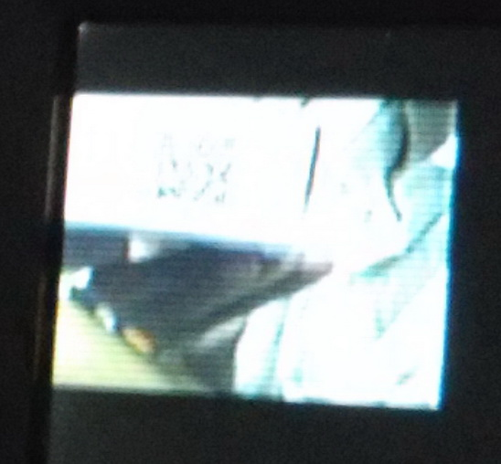
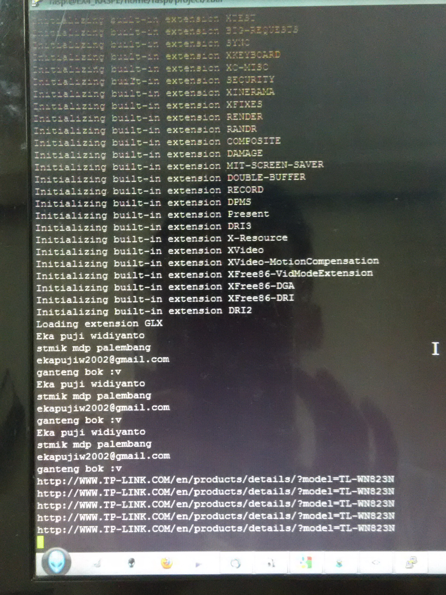

#ZBar : Pengenalan QRCode Barcode  
  
Kali ini kita akan membaca QRCode, Barcode via Raspberry Pi dengan ZBar. Ikuti langkah-langkah berikut ini :  
1.Install zbar dengan perintah : ```sudo pacman -S zbar```  
2.Pastikan bahwa ter-*install* xserver dan desktop manager yang sederhana kalau ingin melihat preview dari gui zbar.  
3.Buat sebuah file bash dengan nama misal **run_zbar.sh** dan set ke mode executable. Isi file ini sebagai berikut :  
```
#!/bin/bash  
LD_PRELOAD=/usr/lib/libv4l/v4l1compat.so zbarcam --raw -q $1 --prescale=320x240 /dev/video0  
```  
4.Jalankan file ini dengan perintah : ```xinit ./run_zbar.sh``` jika ingin melihat previewnya dari konsol. Jika ingin headless, maka jalankan dengan perintah : ```./run_zbar.sh --nodisplay```  
5.Scan kode QRCode ataupun barcode ke depan kamera dan hasil scan akan terlihat di konsol.  




Referensi :  
- http://fitzcarraldoblog.wordpress.com/2012/10/05/installing-and-using-zbar-in-linux-to-scan-bar-codes-with-your-webcam/
