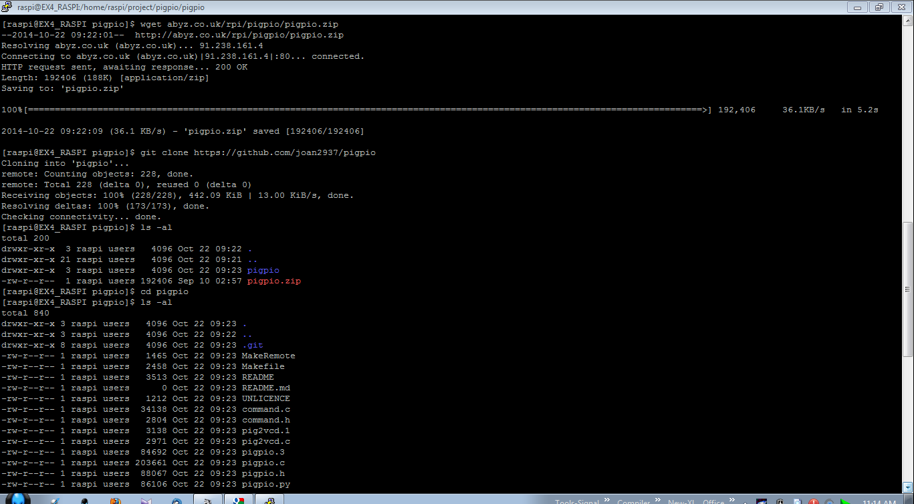
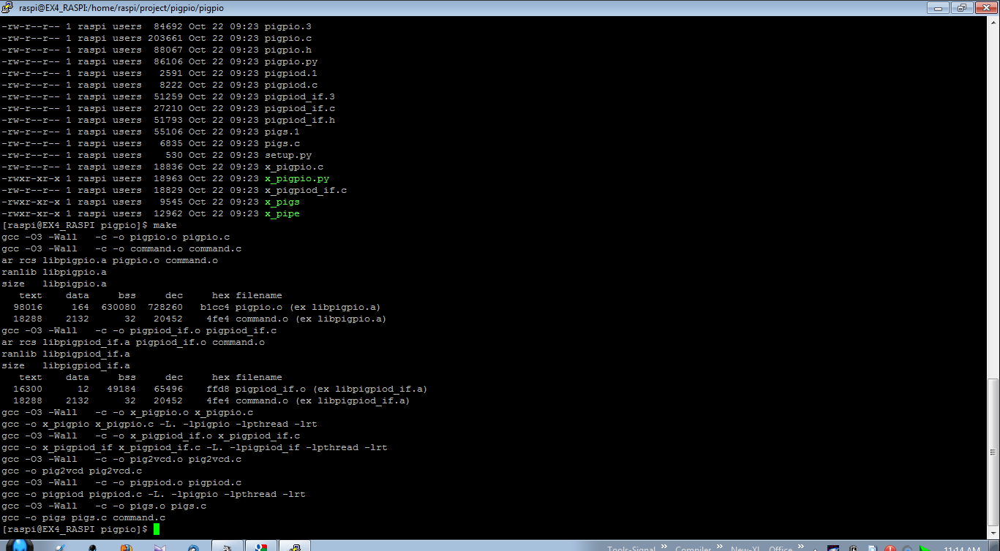
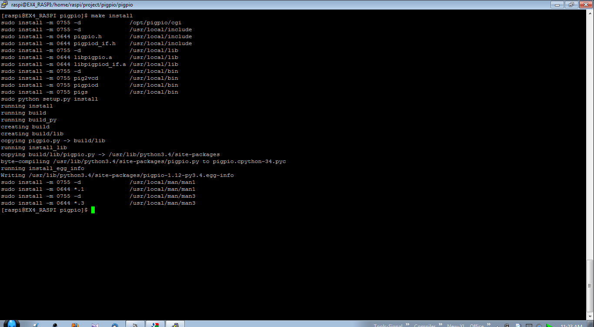
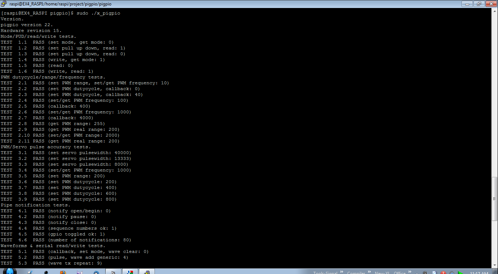
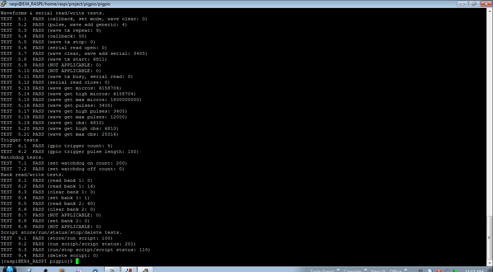

#PiGPIO

PiGPIO merupakan suatu *library* untuk mengakses segala fitur GPIO Raspberry Pi dengan, boleh dikatakan, lebih komplit. Library ini berisi berbagai fungsi untuk membuat proses antarmuka I/O di Raspberry Pi sangat mudah. Fitur-fiturnya yaitu :  
a.Dapat bekerja pada semua pin Raspberry Pi, baik yang internal dipergunakan oleh sistem atau yang tersedia untuk pengguna.  
b.Dapat dipergunakan untuk membangkitkan sinyal PWM dan Servo di pin manapun menggunakan metode DMA.  
c.Sistem thread memungkin aplikasi bersifat *interrupt based* ketimbang *poll based*.  
d.Dapat membaca tulis seluruh pin pada suatu *bank register* Raspberry Pi dengan mudah.  
e.Dapat membangkitkan sinyal dengan ketelitian sampai order mikrodetik.  
f.Berisi fungsi-fungsi untuk : I2C, Serial(Hardware dan Software), SPI.  

Karena PiGPIO hanya sebuah *library* saja, maka instalasinya juga sangat mudah. Pastikan sudah ada kompiler gcc/g++ dan python pada Raspberry Pi Anda. Langkah-langkah instalasinya sebagai berikut :  
1.Unduh PiGPIO dengan perintah : ```wget abyz.co.uk/rpi/pigpio/pigpio.zip``` atau jika ingin mengunduh langsung dari repositori di GitHub maka pergunakan perintah ```git clone https://github.com/ekapujiw2002/pigpio```  
  
2.Unzip file yang telah didownload dengan : ```unzip pigpio.zip```  
3.Pindah ke direktori hasil ekstrak yaitu **pigpio**  
4.Jalankan perintah `make` lalu diikuti `make install` untuk melakukan instalasinya.  
  
  
5.Jika tidak error maka lakukan tes untuk mengecek library ini sudah benar-benar terinstall dengan benar menggunakan perintah ```sudo ./x_pigpio```  
  
  
6.Untuk mengetes proses kompilasi program menggunakan library ini maka donlod sampel scriptnya yaitu Hall Effect dengan perintah ```wget http://abyz.co.uk/rpi/pigpio/code/hall.zip```. Setelah selesai, unzip file ini.  
7.Edit file **hall.c** dan ubah **#define HALL 14** menjadi **#define HALL 25**. Hal ini akan membuat GPIO25 menjadi input. Lihat pada gambar berikut ini.  
  
8.Kompile script **hall.c** dengan perintah ```gcc -o hall hall.c -lpigpio -lrt -lpthread```. Jalankan hasilnya dengan perintah ```sudo ./hall```. Konekkan pin GPIO25 ke Ground maka di layar konsol akan tampil nilai dari pin ini setiap kali ada perubahan. Program ini menggunakan *thread*, bukan *polling*.

Referensi:
- http://abyz.co.uk/rpi/pigpio/index.html
- http://elinux.org/RPi_Low-level_peripherals#General_Purpose_Input.2FOutput_.28GPIO.29
- https://github.com/joan2937/pigpio